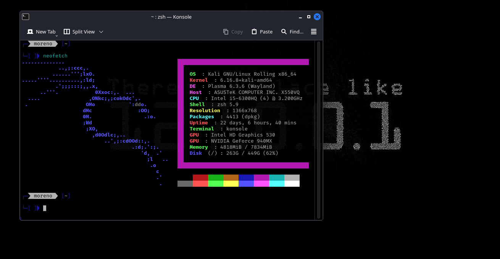

# my-neofetch-config

A small personal Neofetch configuration.

## Requirements
- Neofetch (install examples)
  - Debian / Ubuntu: sudo apt install neofetch
  - Arch / Manjaro: sudo pacman -S neofetch
  - Fedora: sudo dnf install neofetch

## Configuration
- Load the config: place `config.conf` at `~/.config/neofetch/config.conf` or run:
  ```bash
  neofetch --config /full/path/to/config.conf
  ```
- Change displayed items: edit the `info` list (order defines appearance).
- Colors: edit `color` / `colors` variables.
- ASCII art: edit `ascii` or `ascii_distro`, or replace the ASCII block.
- Custom fields: add a function that outputs the value, then add its name to `info`.
